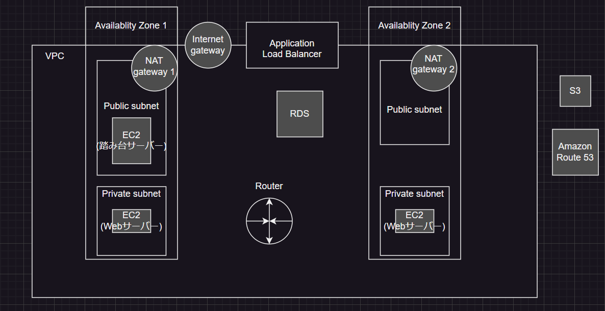

# Rese

【概要】ある企業でのグループ会社の飲食店予約システム

【イメージ】

## 作成した目的

【背景と目的】 外部の飲食店予約サービスは手数料を取られるので自社で予約サービスを持ちたい

## アプリケーションURL

【Amazon Web Services】https://www.aws-intro-mai.com

※AWSのインフラは以下の図のように構成したが、ブラウザへの表示が間に合わず環境の切り分けには至らなかった。

## 機能一覧

| 項目 | 項目 (店舗代表者) | 項目 (管理者) |
| ---- | ---- | ---- |
| 会員登録 | ログイン | ログイン |
| ログイン | ログアウト | ログアウト |
| ログアウト | ユーザー情報取得 | ユーザー情報取得 |
| ユーザー情報取得 | 飲食店一覧取得 | 飲食店一覧取得 |
| ユーザー飲食店お気に入り一覧取得 | 飲食店詳細取得 | 飲食店詳細取得 |
| ユーザー飲食店予約情報取得 | エリアで検索する | エリアで検索する |
| 飲食店一覧取得 | ジャンルで検索する | ジャンルで検索する |
| 飲食店詳細取得 | 店名で検索する | 店名で検索する |
| 飲食店お気に入り追加 | 店舗代表者登録（管理者からの招待メールからのみ可能） | 店舗代表者登録用メール作成 |
| 飲食店お気に入り削除 | 会員へのメール送信（以前店舗に予約があった一般会員のみ） | 店舗代表者一覧取得 |
| 飲食店予約情報追加 | 店舗ページの新規作成 | 一般会員へのメール送信 |
| 飲食店予約情報削除 | 店舗ページの編集 |  |
| エリアで検索する | 店舗の予約情報確認 |  |
| ジャンルで検索する | 来店時予約照会（QRコードの読み取り） |  |
| 店名で検索する |  |  |

## 使用技術

* PHP v7.4.9-fpm
* Laravel v8.83.27
* Docker Desktop v4.22.1
* docker-compose v3.8
* nginx 1.21.1
* mySQL 8.0.26

## テーブル設計

## ER図

# 環境構築

## git clone

先にコピーを保存したいディレクトリに移動してから以下のコマンドを実行します。

`$ git clone git@github.com:magmag6240/project-rese.git`

これでLaravelプロジェクトがローカル環境にクローンされます。

## 開発環境の構築

以下のコマンドで開発環境を構築します。

`$ docker-compose up -d --build`

実行終了後、Docker Desktopを確認し、`project-rese`コンテナが作成されているかを確認してください。

## vendorディレクトリを作る
以下のコマンドを実行してください。

`$ composer install`

`composer.lock`, `composer.json`に書かれた情報を基にパッケージやライブラリがまとめてインストールされ、`vendor`ディレクトリに配置されます。

## .envファイルを作る
git cloneしてきたプロジェクトに入っている`.env.example`ファイルを基に以下のコマンド実行で`.env`ファイルを作成します。

`$ cp .env.example .env`
`$ exit`

作成後、`.env`ファイルの内容を以下のように修正します。

// 前略

DB_CONNECTION=mysql  
DB_HOST=mysql  
DB_PORT=3306  
DB_DATABASE=laravel_db  
DB_USERNAME=laravel_user  
DB_PASSWORD=laravel_pass  

// 後略

## アプリケーションキーを初期化する
以下のコマンドで初期化を行います。

`$ php artisan key:generate`

## 動作確認
ブラウザに表示する準備は整いました。
以下のコマンド実行で、動作確認を行ってください。

`$ php artisan serve`

## ユーザー

* 一般会員（ランダム）：999人
* 一般会員（使用可能）：1人
* 店舗代表者：20人
* 管理者：1人

### 一般会員

| id | name | email | password |
| ---- | ---- | ---- | ---- |
| 1 | 一般ユーザー | user@user.user | password |

### 店舗代表者

| id | name | email | password |
| ---- | ---- | ---- | ---- |
| 1 | 虎杖 悠仁 | yuji.itadori@example.com | password |
| 2 | 伏黒 恵 | megumi.fushiguro@example.com | password |
| 3 | 釘崎 野薔薇 | nobara.kugisaki@example.com | password |
| 4 | 禪院 真希 | maki.zenin@example.com | password |
| 5 | 狗巻 棘 | toge.inumaki@example.com | password |
| 6 | パンダ | panda@example.com | password |
| 7 | 乙骨 憂太 | yuta.okkotu@example.com | password |
| 8 | 三輪 霞 | kasumi.miwa@example.com | password |
| 9 | 東堂 葵 | takada.todo@example.com | password |
| 10 | 禪院 真依 | mai.zenin@example.com | password |
| 11 | 西宮 桃 | momo.nishimiya@example.com | password |
| 12 | 与 幸吉 | kokichi.yota@example.com | password |
| 13 | 加茂 憲紀 | noritoshi.kamo@example.com | password |
| 14 | 五条 悟 | satoru.gojyo@example.com | password |
| 15 | 夏油 傑 | suguru.geto@example.com | password |
| 16 | 家入 硝子 | shoko.ieiri@example.com | password |
| 17 | 冥冥 | meimei@example.com | password |
| 18 | 庵 歌姫 | utahime.iori@example.com | password |
| 19 | 七海 建人 | kento.nanami@example.com | password |
| 20 | 灰原 雄 | yu.haibara@example.com | password |

### 管理者

| id | name | email | password |
| ---- | ---- | ---- | ---- |
| 1 | 管理者 | admin@admin.admin | password |

